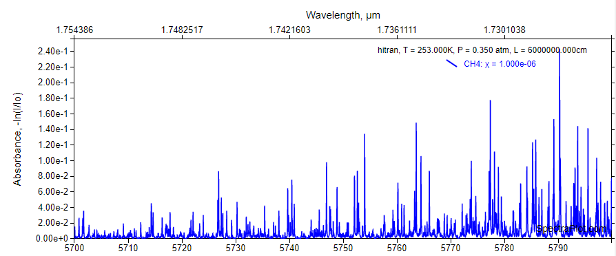

# spectracrawl

Run this program and
it shall scrape gas absorption data from 
[spectraplot.com's](http://www.spectraplot.com/absorption) 
HITRAN database. See
`.spectracrawl.yml` (config file) for options. Should be 
pretty self explanatory from there on out.

Requires a chrome driver. Get it from 
`https://chromedriver.chromium.org/` or something. 
Files will be downloaded to default chrome download
directory so you'll have to pass your download 
directory in the config file.